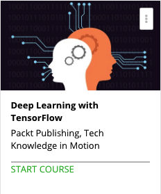

```
Roberto Nogueira  
BSd EE, MSd CE
Solution Integrator Experienced - Certified by Ericsson
```
# Deep Learning with Tensorflow



**About This Course**

Channel the power of deep learning with Google's TensorFlow!

## Topics
```
Getting Started
[ ] 1. The Course Overview 2:59
[ ] 2. Installing TensorFlow 5:33
[ ] 3. Simple Computations 5:31
[ ] 4. Logistic Regression Model Building 6:58
[ ] 5. Logistic Regression Training 4:53

Section: 2
0 / 5
Deep Neural Networks
[ ] 6. Basic Neural Nets 5:14
[ ] 7. Single Hidden Layer Model 5:05
[ ] 8. Single Hidden Layer Explained 4:32
[ ] 9. Multiple Hidden Layer Model 5:22
[ ] 10. Multiple Hidden Layer Results 4:43

Section: 3
0 / 7
Convolutional Neural Networks
[ ] 11. Convolutional Layer Motivation 5:03
[ ] 12. Convolutional Layer Application 6:55
[ ] 13. Pooling Layer Motivation 3:58
[ ] 14. Pooling Layer Application 4:17
[ ] 15. Deep CNN 6:28
[ ] 16. Deeper CNN 4:08
[ ] 17. Wrapping Up Deep CNN 4:55

Section: 4
0 / 3
Recurrent Neural Networks
[ ] 18. Introducing Recurrent Neural Networks 9:02
[ ] 19. skflow 9:19
[ ] 20. RNNs in skflow 4:04

Section: 5
0 / 2
Wrapping Up
[ ] 21. Research Evaluation 6:55
[ ] 22. The Future of TensorFlow 4:18
```
